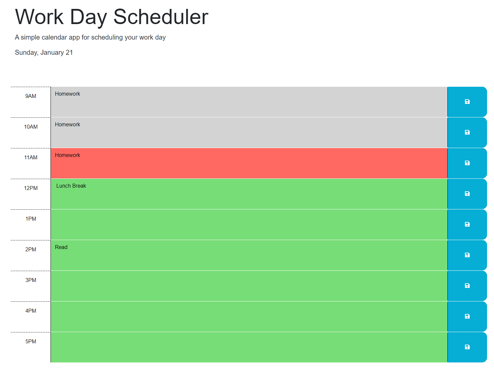

# work-day-scheduler

## Description
Work day scheduler is a simple calendar application that allows a user to save events for each hour of the day. This app runs in the browser and features dynamically updated HTML and CSS powered by jQuery.

## Features
* Current day is displayed at the top of the calendar
* Timeblocks for standard business hours
* Timeblocks are color coded to indicate whether it is in the past, present, or future
* Clicking on a timeblock allows the user to enter an event
* Clicking the save button for that timeblock saves the text for that event in local storage
* Saved events persist when the page is refreshed

## Screenshot

## Link to Deployed Application
https://aaronh-o.github.io/work-day-scheduler/
